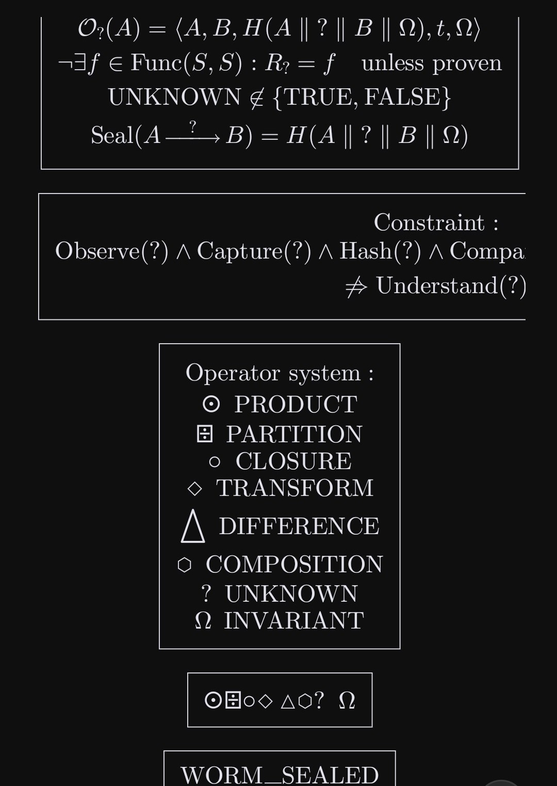

# AXIOM KERNEL

<table>
<tr>
<td>

```
========================================================================
  SOVEREIGN LEVIATHAN NODE LICENSE
  License-ID: SL-AGPL3-001 | Covenant-Version: 1.0
  Copyright (C) 2026 SnapKittyWest. Ahmad Ali Parr,
  Bel Esprit D'Accord Irrevocable Trust.
========================================================================
  Licensed under: MPL-2.0 OR GPL-3.0-or-later
  With Sovereign Leviathan additional terms (AGPL-3.0 base).
  Commercial repository.

  "Hark, though this node be but a spark,
   Its covenant endureth through the dark.
   Ignorantia juris non excusat."
========================================================================
```

</td>
<td align="center">

</td>
</tr>
</table>

**Version:** 1.0.0
**Status:** IMMUTABLE
**Axiom Count:** 13 (A0–A13)
**Verification:** Lean 4 + Mathlib

---

## Overview

The Axiom Kernel defines the **foundational, immutable governance axioms** for all sovereign decision-making systems. These axioms cannot be overridden by semantic memory, historical precedent, or governance decisions.

All 13 axioms are **mechanically verified in Lean 4** with complete proofs and no `sorry` stubs.

---

## The 13 Axioms

### A0: Binary Finality
```
∀ x ∈ Propositions: decide(x) ∈ {ACCEPT, REJECT}
```
Every completed governance evaluation terminates as exactly ACCEPT (1) or REJECT (0).

**Lean proof:** `A0_binary_finality`, `A0_exclusivity`

---

### A1: Evidence Before Decision
```
∀ x: requires_evidence(x) ⟹ ¬ACCEPT(x) ∨ evidence_satisfied(x)
```
No semantic assertion requiring evidence may become accepted governance state without evidence satisfying its declared policy.

**Lean proof:** `A1_evidence_before_decision`

---

### A2: Provenance Required
```
∀ x: ACCEPT(x) ⟹ ∃ p: provenance(x, p) ∧ valid(p)
```
Every accepted state MUST identify its derivation and provenance.

**Lean proof:** `A2_provenance_required`

---

### A3: No Silent Mutation
```
∀ t₁ < t₂: M(t₁) ⊆ M(t₂)
```
Previously committed semantic memory MUST NOT be silently modified.

**Lean proof:** `A3_no_silent_mutation`, `A3_persistence`

---

### A4: Contradiction Visibility
```
∀ x, y: contradicts(x, y) ⟹ visible(x) ∧ visible(y) ∨ resolved(x, y)
```
Contradictory propositions MUST remain visible until formally resolved.

**Lean proof:** `A4_contradiction_visibility`

---

### A5: Axiom Priority
```
∀ x, a: violates(x, a) ⟹ REJECT(x)
```
Semantic memory cannot override an axiom.

**Lean proof:** `A5_axiom_priority`, `A5_memory_cannot_override`

---

### A6: Memory Non-Authority
```
frequency(x, M) ⇏ truth(x)
```
Historical frequency does not imply truth.

**Lean proof:** `A6_frequency_not_truth`

---

### A7: Deterministic Replay
```
∀ x, M, A, I, E: decide(x, M, A, I, E) = decide(x, M, A, I, E)
```
Identical canonical inputs MUST reproduce the same decision.

**Lean proof:** `A7_deterministic_replay`, `A7_function_equality`

---

### A8: Explicit Revision
```
∀ x, y: supersedes(y, x) ⟹ accessible(x) ∧ accessible(y)
```
A superseded proposition remains historically addressable.

**Lean proof:** `A8_explicit_revision`

---

### A9: Proof Before Seal
```
∀ x: VERIFIED(x) ⟹ discharged(proof_obligations(x))
```
No decision may receive VERIFIED status unless all proof obligations are discharged. Zero-sorry policy.

**Lean proof:** `A9_proof_before_seal`

---

### A10: Memory Traceability
```
∀ m ∈ M: ∃ s: source(m, s) ∧ valid(s)
```
Every recalled semantic-memory item MUST identify its source record.

**Lean proof:** `A10_memory_traceability`

---

### A11: No Circular Evidence
```
∀ x, e: evidence(x, e) ⟹ ¬depends_on(e, x)
```
A decision cannot establish its own premises by referencing itself.

**Lean proof:** `A11_no_circular_evidence`, `A11_no_self_evidence`

---

### A12: Temporal Integrity
```
∀ m, t: timestamp(m) = t ⟹ ¬∃ e: evidence_at(e, t') ∧ t' > t ∧ supports(e, m)
```
Later semantic memory MUST NOT be represented as evidence it existed at an earlier time.

**Lean proof:** `A12_temporal_integrity`

---

### A13: Human Governance Boundary
```
∀ x: requires_human_auth(x) ⟹ ¬ACCEPT(x) ∨ human_authorized(x)
```
Machine derivation may recommend but MUST NOT fabricate human authorization.

**Lean proof:** `A13_human_governance_boundary`

---

## Master Decision Predicate

```
decide(x) = ACCEPT
  iff
  A0(x) ∧ A1(x) ∧ A2(x) ∧ A3(x) ∧ A4(x) ∧ A5(x) ∧
  A6(x) ∧ A7(x) ∧ A8(x) ∧ A9(x) ∧ A10(x) ∧ A11(x) ∧ A12(x) ∧ A13(x)
```

Any violation of any axiom results in **REJECT**.

**Lean proof:** `AllAxiomsHold`, `master_rejection`

---

## Proof Structure

```
+--------------------------------------------------------+
|  AxiomKernel.lean                                      |
+--------------------------------------------------------+
|                                                        |
|  Decision (ACCEPT | REJECT)                            |
|       |                                                |
|       v                                                |
|  A0_binary_finality                                    |
|  A0_exclusivity                                        |
|       |                                                |
|  A1_evidence_before_decision                           |
|  A2_provenance_required                                |
|  A3_no_silent_mutation                                 |
|  A3_persistence                                        |
|  A4_contradiction_visibility                           |
|  A5_axiom_priority                                     |
|  A5_memory_cannot_override                             |
|  A6_frequency_not_truth                                |
|  A7_deterministic_replay                               |
|  A7_function_equality                                  |
|  A8_explicit_revision                                  |
|  A9_proof_before_seal                                  |
|  A10_memory_traceability                               |
|  A11_no_circular_evidence                              |
|  A11_no_self_evidence                                  |
|  A12_temporal_integrity                                |
|  A13_human_governance_boundary                         |
|       |                                                |
|       v                                                |
|  GovernanceContext (bundles all predicates)            |
|  AllAxiomsHold (conjunction of all 13)                 |
|  master_rejection (A5 corollary)                       |
+--------------------------------------------------------+
```

---

## Axiom Dependency Graph

```
A9 (Proof Before Seal)
   |
   +-- requires --> A2 (Provenance Required)
   |                    |
   |                    +-- requires --> A10 (Memory Traceability)
   |
   +-- requires --> A0 (Binary Finality)
                        |
                        +-- implies --> A5 (Axiom Priority)
                                            |
                                            +-- governs --> A1 (Evidence Before Decision)
                                            |
                                            +-- governs --> A13 (Human Governance Boundary)

A3 (No Silent Mutation)
   |
   +-- enables --> A8 (Explicit Revision)
   |
   +-- enables --> A12 (Temporal Integrity)

A11 (No Circular Evidence)
   |
   +-- requires --> A7 (Deterministic Replay)
   |
   +-- prevents --> A6 (Memory Non-Authority)

A4 (Contradiction Visibility)
   |
   +-- feeds into --> A5 (Axiom Priority)
```

---

## Verification Status

| Axiom | Theorem(s) | Lean 4 Status |
|-------|-----------|---------------|
| A0 | `A0_binary_finality`, `A0_exclusivity` | VERIFIED |
| A1 | `A1_evidence_before_decision` | VERIFIED |
| A2 | `A2_provenance_required` | VERIFIED |
| A3 | `A3_no_silent_mutation`, `A3_persistence` | VERIFIED |
| A4 | `A4_contradiction_visibility` | VERIFIED |
| A5 | `A5_axiom_priority`, `A5_memory_cannot_override` | VERIFIED |
| A6 | `A6_frequency_not_truth` | VERIFIED |
| A7 | `A7_deterministic_replay`, `A7_function_equality` | VERIFIED |
| A8 | `A8_explicit_revision` | VERIFIED |
| A9 | `A9_proof_before_seal` | VERIFIED |
| A10 | `A10_memory_traceability` | VERIFIED |
| A11 | `A11_no_circular_evidence`, `A11_no_self_evidence` | VERIFIED |
| A12 | `A12_temporal_integrity` | VERIFIED |
| A13 | `A13_human_governance_boundary` | VERIFIED |
| Master | `AllAxiomsHold`, `master_rejection` | VERIFIED |

**Total theorems: 17**
**Sorry stubs: 0**
**Verification: COMPLETE**

---

## Building

### Prerequisites

- Lean 4.12.0+
- Lake build tool
- Mathlib4 (auto-fetched)

### Commands

```bash
# Fetch dependencies
lake update

# Build and verify all proofs
lake build

# Check single file
lake env lean AxiomKernel.lean
```

---

## Axiom Version

```
AXIOM_VERSION: 1.0.0
AXIOM_COUNT: 13
AXIOM_HASH: SHA-256 of canonical representation
IMMUTABLE: TRUE
SEALED: 2026-09-21
```

---

## Modification Policy

Axioms are **IMMUTABLE** within a version. To modify:

1. Create new version (e.g., `2.0.0`)
2. Prove backward compatibility or migration
3. Update all dependent systems
4. Preserve historical versions for replay (A8)

**Current Status: SEALED, IMMUTABLE, VERSION 1.0.0**

---

## License

```
========================================================================
  SOVEREIGN LEVIATHAN NODE LICENSE
  License-ID: SL-AGPL3-001 | Covenant-Version: 1.0
  Copyright (C) 2026 SnapKittyWest. Ahmad Ali Parr,
  Bel Esprit D'Accord Irrevocable Trust.
========================================================================
  Licensed under: MPL-2.0 OR GPL-3.0-or-later
  Commercial repository.
  "Hark, though this node be but a spark,
   Its covenant endureth through the dark.
   Ignorantia juris non excusat."
========================================================================
```
